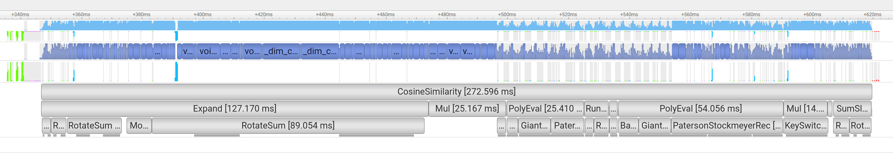

# Lattica Fetch-by-Similarity Submission

This document describes Lattica's submission to the Fetch-by-Similarity FHE benchmarking workload.

In this doc we provide a description of the workload structure, cryptographic parameterization, level and scale management, and performance characteristics of the submission. All data reported here corresponds to an end-to-end execution of the harness.

---

## Database Configuration

* **Mode:** SMALL
* **Database size:** 50,000 records
* **Record dimension:** 128
* **Payload dimension:** 7

The submission evaluates encrypted similarity queries against a fixed encrypted database and returns matching payloads.

---

## Execution environment

**Client**

* AWS c5.4xlarge
* 16 vCPUs, 32GB RAM

**Server**

* AWS EC2 g7e.2xlarge
* NVIDIA GB202 (96 GB)
* 8 vCPUs, 64 GB RAM

Both machines are in the same AWS region (us-east-1)

---

## Cryptographic parameters and security

The submission uses the following parameters:

* **Ring dimension:** 2**16 = 65536
* **Total modulus size:** ~845 bits (540 compute levels + 305 GHS)
* **Secret key distribution:** sparse ternary, Hamming weight 192

Security estimate yields approximately 256 bits of security, exceeding standard 128-bit targets:
```python
from estimator import *
Logging.set_level(Logging.LEVEL0)
params = LWE.Parameters(n=2**16, q=2**845, Xs=ND.SparseTernary(96), Xe=ND.DiscreteGaussian(3))
LWE.estimate.rough(params)
```

Result:

```
Logging.set_level(Logging.LEVEL0)
params = LWE.Parameters(n=2**16, q=2**845, Xs=ND.SparseTernary(96), Xe=ND.DiscreteGaussian(3))
LWE.estimate.rough(params)

usvp                 :: rop: ≈2^257.3, red: ≈2^257.3, δ: 1.002248, β: 881, d: 129817, tag: usvp
dual_hybrid          :: rop: ≈2^256.7, red: ≈2^256.7, guess: ≈2^198.5, β: 879, p: 2, ζ: 0, t: 180, β': 879, N: ≈2^134.4, m: ≈2^16.0
```
---

## Pipeline levels breakdown

### 2D moduli chain

We are using a technique that we call a *2D modulus chain*, which allows us to decouple optimizations related to plaintext scaling via mod-switching, and optimizations related to the machine register size.

Each ROW of the our 2D chain is a single int64 number, which is the product of one or more “good” primes. Conceptually, each element in the 2D chain can be consumed as a level (in the context of mod-switching), so the overall number of levels is the sum of number of COLs in each ROW. However, the size and computational overhead grows with the number of ROWS rather than with the number of levels.

### Deferred modulus switching
In some cases we also postpone mod-switching until after multiple scales were accumulated. E.g. in `expand`, we perform 3 consecutive `ct*const` multiplications, each increasing the number of bits of the scale by 20, and only then mod-switch down by a full 60 bit row.

### Moduli chain structure
```python
full_q_list_precision=(
                    (60, 30,), # expand, inner product
                    (60, 30),  # chebyshev
                    (60, 30),  # chebyshev
                    (60, 30),  # running sum, running_sum * selectors
                    (60, 30),  # chebyshev
                    (60, 30),  # chebyshev
                    (60, 30),  # chebyshev
                    (60, 30),  # one_hots * payloads, payloads * packing mask
                    (60,),
                ),
level_sizes_running_sum = [8, 4]           # prod should be 32
level_sizes_expand      = [2, 4, 4, 4,]    # prod should be 128
g_base_bits             = 300              # decomposition basis
ghs_keyswtich_scale     = 5*(61,)          # scale-up by additional 305 bits

input_pt_scale    = 2**30
```

### Scale management and level consumption
The pipeline carefully controls scale growth and modulus switching to maintain precision throughout the computation. Key properties include:

* Deferred modulus switching after multiple constant multiplications.
* Explicit scale restoration before reduction-heavy stages.


## Performance characteristics

* Evaluation key: ~670 MB
* Encrypted database: ~2.3 GB
* Encrypted query: 9 MB
* Total inference time: ~0.5 s (**includes network time**)
* Compute inference time: 284 ms (**compute time only**)


### Homomorphic computation time breakdown



* Expand: 127 ms
* Inner product: 25 ms
* Cheb threshold: 25 ms
* Running_sum: 7 ms
* Mul selectors X running_sum: 3 ms
* Cheb masks: 54 ms
* Extract and pack payloads: 30 ms

**Total encrypted compute time:** ~272 ms

## Comparative reference

Relative to the reference OpenFHE implementation provided with the benchmark suite:

| **Stage** | **Lattica**                | **OpenFHE** |
| --- |----------------------------|-------------|
| **Key Generation** | 12.5 s                      | 8.1 s       |
| **DB encryption** | 54.4 s                     | 102.9 s     |
| **Encrypted computation** | 0.28 s (0.5 s  end-to-end) | 125.8 s     |
| **Public & evaluation keys** | 0.67 G                      | 2.4 G       |
| **Encrypted database** | 2.3 G                      | 5.6G        |
| **Encrypted query** | 9 M                       | 24M         |


* Encrypted computation is approximately **440x faster**.
* Ciphertext sizes (query, keys, database) are **2.7x, 3.5x, 2x smaller**, respectively.

All comparisons are performed at comparable security levels.

